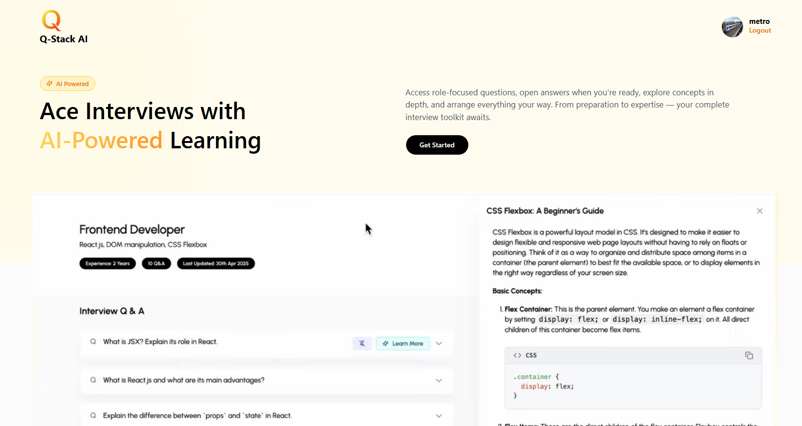

# Q-Stack AI

**Q-Stack AI** is a full-stack web application designed to help users prepare for interviews by generating AI-powered questions, explanations, and managing interview sessions. The app leverages modern technologies to provide a seamless and interactive experience for users.

---

## Features

### Backend:
- **User Authentication**: Secure user registration, login, and profile management using JWT.
- **Session Management**: Create, retrieve, and delete interview sessions with associated questions.
- **AI Integration**: Generate interview questions and concept explanations using AI APIs.
- **File Uploads**: Upload and manage profile pictures with `multer`.

### Frontend:
- **Dynamic UI**: Built with React and Vite for fast and responsive user interfaces.
- **Global State Management**: Manage user authentication and session data using React Context API.
- **Interactive Components**: Includes loaders, modals, and expandable cards for a better user experience.
- **AI-Powered Features**: Generate explanations and learn more about interview concepts.

---

## Tech Stack

### Backend:
- **Node.js**: Server-side runtime.
- **Express.js**: Web framework for building RESTful APIs.
- **MongoDB**: NoSQL database for storing user, session, and question data.
- **Mongoose**: ODM for MongoDB.
- **JWT**: Secure user authentication.
- **Multer**: File upload handling.

### Frontend:
- **React**: Component-based UI library.
- **Vite**: Fast development build tool.
- **Axios**: HTTP client for API requests.
- **Tailwind CSS**: Utility-first CSS framework for styling.

---

## Folder Structure

### Backend:
- **`controllers/`**: Handles business logic for authentication, sessions, and AI features.
- **`middlewares/`**: Includes authentication and file upload middleware.
- **`models/`**: Mongoose schemas for `User`, `Session`, and `Question`.
- **`routes/`**: API endpoints for authentication, sessions, and questions.
- **`uploads/`**: Stores uploaded profile pictures.

### Frontend:
- **`components/`**: Reusable UI components like loaders, cards, and inputs.
- **`context/`**: Manages global state for user authentication.
- **`pages/`**: Contains main pages like `SignUp`, `Dashboard`, and `InterviewPrep`.
- **`utils/`**: Helper functions, API paths, and Axios instance configuration.

---

## Contact

For any questions, feedback, or support, feel free to reach out:

- **Email**: proaryans983@gmail.com
- **Website**: https://aryan-kumar-shaw.vercel.app/

---